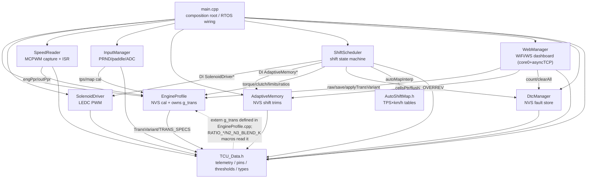
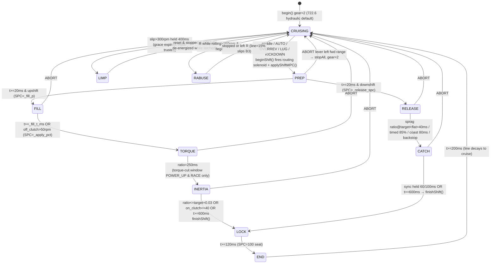

# Architecture Review — 722.6 TCU (June 2026)

Full-codebase review of `src/` (~3,600 LOC). Every claim verified against source;
line numbers are as of commit `48c4b83`. Companion work plan: `ARCH_FIXES_PLAN.md`
(fix designs + live status — read that first when resuming work).

Corrections to folklore, established during review:
- **Stack units are bytes, not words** — `xTaskCreatePinnedToCore` on the ESP32
  Arduino port takes bytes. Both app tasks get 8 KB.
- **There is a third software task nobody declares**: the AsyncTCP service task,
  **priority 10, no core affinity**, 16 KB stack (`AsyncTCP.h:55,68`,
  `AsyncTCP.cpp:352`). All WebSocket command handlers (`set_profile`, `set_cells`,
  `limp_reset`) execute there — higher priority than the 1 kHz control loop and
  able to preempt it on Core 1.

---

## 1. Module dependency graph

**Layers (top→bottom):**
- **L0 composition root** — `main.cpp`: no logic; deliberate `begin()` order
  (engineProfile first: `main.cpp:47-53`), spawns 2 pinned tasks, DI pointers.
- **L1 control** — `ShiftScheduler`: only true control module.
- **L1 comms (isolated)** — `WebManager`: touches only managers + shared-data;
  never the drivers or the scheduler.
- **L2 drivers** — `SolenoidDriver`, `InputManager`, `SpeedReader`: no
  cross-dependencies; input/speed reach up only for calibration getters.
- **L3 managers / persistence** — `AdaptiveMemory`, `DtcManager`, `EngineProfile`.
- **L4 shared-data leaf** — `TCU_Data.h` + `AutoShiftMap.h`: include nothing project-local.

**The one cycle:** `TCU_Data.h:75` declares `extern TransSpec g_trans`; its
`RATIO_*` / `N2_N3_BLEND_K` macros read it; it is *defined* in
`EngineProfile.cpp:9`. Link-time back-edge only (headers compile acyclically),
but anything using a ratio macro is link-coupled to EngineProfile, and the live
variant-switch race (R4) rides this seam.

**Runtime coupling not in the include graph:** the global `telemetry` struct is
a lock-free bus — four Core-1 writers, Core-0/asyncTCP readers/writers.

---

## 2. Task table & shared-resource ownership

### Execution contexts

| Context | Pri | Stack | Core | Cadence | Role | Ref |
|---|---|---|---|---|---|---|
| PhysicsTask (`core1PhysicsTask`) | 5 | 8 KB | 1 | 1 kHz `vTaskDelayUntil` | inputs → speeds → shift SM → solenoids → DTC poll; overrun soft-watchdog | `main.cpp:58,69-93` |
| DashboardTask (`core0DashboardTask`) | 1 | 8 KB | 0 | ~200 Hz loop, ~60 Hz broadcast | telemetry JSON + trace dump; NVS flush (DTC, adaptation) | `main.cpp:59,98-104` |
| async_tcp (library) | **10** | 16 KB | **none** | event-driven | all WS command handlers | `AsyncTCP.cpp:352`; `WebManager.cpp:43-56` |
| loopTask (Arduino) | 1 | ~8 KB | 1 | once | deleted at boot | `main.cpp:62-64` |
| onCaptureISR ×4 | ISR (IRAM) | — | 1 | per edge | timestamp, glitch-reject, ring write | `SpeedReader.cpp:25,61-62` |

Priority inversion hazard: async_tcp (10) > PhysicsTask (5); no affinity → a
large `set_profile` JSON parse can preempt the control loop on Core 1.

### Shared resources & guarding

| Resource | Touched by | Guard | Verdict |
|---|---|---|---|
| `telemetry` scalars/floats (`TCU_Data.h:264-352`) | Core1 writers; Core0 reader; asyncTCP writes `limp_reset_request` | **NONE** (word-atomicity assumed) | stale/torn cross-core reads; mostly cosmetic but it is the control bus |
| status strings + seq (`TCU_Data.h:392-406`) | Core1 writer, Core0 reader | **seqlock** | correct — single-writer only, unenforced |
| `AdaptiveMemory._dirty` (`AdaptiveMemory.cpp:80-114`) | Core1 / Core0 / asyncTCP | **portMUX** | the ONLY correctly-locked cross-core resource |
| `AdaptiveMemory._cells` (`AdaptiveMemory.cpp:39,46,54-76`) | Core1 getCell/learn; Core0 NVS save; asyncTCP raw-ptr write | **NONE** | torn 3-byte cell applied or persisted |
| `AdaptiveMemory._flush_now` | Core1 set; Core0 read+clear | **NONE** | lost forced flush; benign (60 s timer recovers) |
| `engineProfile.d` (`WebManager.cpp:134-186`) | Core1 readers every tick; asyncTCP writer | **NONE** | torn multi-field calibration mid-shift |
| `g_trans` (`EngineProfile.cpp:11-16`) | Core1 ratio macros; asyncTCP whole-struct copy | **NONE** | mixed old/new geometry mid-shift |
| `shiftTrace` ring (`ShiftScheduler.cpp:280-318`; `WebManager.cpp:261-287`) | Core1 producer; Core0 consumer | volatile flags | contract-by-comment, holds today |
| `dtcManager._count/_active/_last_ms` (`DtcManager.cpp:34-79`) | Core1 poll/trip; Core0 flush; asyncTCP clearAll | **NONE** | torn/lost fault history |
| `SpeedChannel` rings (`SpeedReader.cpp:136-174`) | ISR writer; Core1 reader | **PARTIAL** (head/count under IRQ-disable; ring + int64 read unlocked) | safe only because ISR and update() share Core 1 (confirmed) |
| SolenoidDriver state; commanded-pressure bytes | Core1 only, sequential in one tick | NONE | safe today; latent if any caller moves off Core 1 |

---

## 3. Shift-logic state machine

Single state var `_current_phase` (`ShiftScheduler.h:20-30`). Pressure API
**inverted** (100 % = de-energized = native max). Pressure moves on 20 ms
pticks; exits evaluated at 1 kHz; ratio-derivative predicates advance only on
new 200 Hz speed samples. Three priority overlays above the phase engine.

- Convergence: `finishShift()` (`ShiftScheduler.cpp:943`) — stop routing
  solenoid (gear latches), `current_gear=target`, adapt, enter LOCK.
- Overlay priority in `update()`: reverse-abuse (`:723`) > limp (`:726`) >
  mid-shift abort (`:802-810`).
- Timers: PREP 20 ms; FILL 0–400 ms; TORQUE backstop 250 ms; INERTIA sweep
  220–400 ms, backstop 600 ms; RELEASE backstop 500/450/80 ms
  (sprag/timed/coast); CATCH dwell 60/100 ms, backstop 600 ms; LOCK 120 ms;
  END 200 ms; auto-shift cooldown 500 ms; engage grace 1500 ms.
- Every active phase has a wall-clock backstop — robust to jitter, useless if
  the task itself stalls (see R2).

---

## 4. Top 10 architectural risks (consequence-to-gearbox × plausibility)

**R1 — Stale gear state fires the wrong routing solenoid → planetary cross-apply.**
(a) Engage-at-speed resync defers ratio correction 1.5 s, but paddle + entire
auto/safety layer run with no `_gear_resync_pending` gate
(`ShiftScheduler.cpp:846-883`); (b) mid-shift abort hard-sets `current_gear=2`
with no ratio reclassification (`:802-810`). Next shift energizes a routing
valve wrong for the actual gear → two elements engaged → shock/lockup.

**R2 — No watchdog, no safe-state on a Core-1 stall; routing kick has no
hardware timeout.** No `esp_task_wdt_*`; loopTask (TWDT feeder) deleted
(`main.cpp:62-64`); overrun "watchdog" only trips a DTC (`main.cpp:87-90`).
The 80 %→37 % kick step-down happens only when `update()` re-enters
(`SolenoidDriver.cpp:56-64`). A hang mid-shift holds a 4 Ω coil at ~80 % and
SPC at last value — clutch burn or held tie-up, no fail-to-neutral.

**R3 — Sensor loss fails open; DTCs never change actuation.** No per-channel
speed validity: dead OUT sensor = "stopped" → limp never arms
(`ShiftScheduler.cpp:563`), reverse-abuse never arms (`:681`), phantom
downshifts. Dead ENG sensor → overrev guard inert, lug guard fires continuously
(`:422,440`). Both dead → money-shift guard predicts 0, passes everything
(`:226-237`). Nothing reads `dtcManager` to alter actuation
(`DtcManager.cpp:51-59`).

**R4 — Live web tuning races Core 1 from a higher-priority, no-affinity task.**
`set_profile` rewrites torque table + clutch arrays element-by-element
(`WebManager.cpp:138-184`); `applyTransVariant()` reassigns whole `g_trans`
(`EngineProfile.cpp:13`); `set_cells` writes adapt array via raw pointer — all
unlocked while Core 1 reads them every tick. Torn calibration mid-shift →
SPC/MPC far too low (flare/glaze) or too high (slam).

**R5 — Every power upshift hands over at full input torque; torque-cut is
compile-disabled.** `ENABLE_TORQUE_CUT=false` forces the GPIO low
(`SolenoidDriver.cpp:128-130`, `TCU_Data.h:223`); only requested for POWER_UP
in RACE (`ShiftScheduler.cpp:903-908`). ~380 Nm through a 330 Nm-rated W5A330:
dominant chronic clutch-wear mechanism (esp. 3-4 / B2).

**R6 — Predictive OVERREV upshift has no plausibility guard.** Money-shift
prediction is `if (!is_upshift)` only (`ShiftScheduler.cpp:226,421-433`);
combined with R5, every limiter-bounce upshift slams the oncoming clutch
through a large slip delta unmitigated.

**R7 — Limp protection suppressed in several windows.** Disabled during engage
grace, whenever `!input_speed_trusted` — re-evaluated only in gears 2-4 while
cruising, otherwise held indefinitely (`ShiftScheduler.cpp:554-557,763-773`) —
and above tps 80 / map 130. Genuine slip in 5th after a latched glitch is
invisible until a 2-4 cruise clears the flag.

**R8 — Reverse-at-speed failsafe defeatable via instantaneous edge latch.**
`_legit_reverse` latches if `output_rpm<=150` at the R-entry instant
(`ShiftScheduler.cpp:673-681`); a momentary dip below ~5 km/h as the lever
lands in R legitimizes any subsequent speed → B3 at full line against forward
rotation.

**R9 — Limp/abort/LOCK can command SPC=100 (max apply) on an ambiguous
between-gears state.** Limp entry mid-INERTIA lands full apply pressure while
elements are mid-crossover (`ShiftScheduler.cpp:730-731,1091-1093`).
(De-energized IS the ATSG-native failsafe — evaluate before "fixing".)

**R10 — Comms-core integrity.** Unguarded telemetry; torn adapt cells persisted;
`clearAll` races Core-1 edges (`DtcManager.cpp:67-71`); ~30–70 KB transient
String+JsonDocument per shift, no alloc check (`WebManager.cpp:266-285`);
`SPIFFS.begin(true)` silently reformats the dashboard on mount failure
(`WebManager.cpp:24`). No gearbox damage, but loses the only fault display.

**Honorable mentions:** sub-1.5 ms loop overruns slip cadence with no DTC
(`main.cpp:87`); blocking `Serial.println` on the shift-critical path
(`ShiftScheduler.cpp:233,427`); boot Y3 crank pulse can stay asserted through
the SPIFFS-format/WiFi window because `update()` isn't running yet to time it
out (`SolenoidDriver.cpp:39` vs `main.cpp:56-58`).

---

## 5. Unresolved / flags

- `checkCoastDownSchedule()` implemented but never called (`ShiftScheduler.cpp:458`,
  update() calls only checkSafetyShifts/checkKickdown/checkAutoShift at
  `:814-816`). Confirm intentional dead code, then delete.
- SpeedReader ISR-vs-update() sharing is valid **because both run on Core 1**
  (begin() runs in setup()→loopTask→Core 1). int64 `last_edge_us` torn read
  remains theoretical.
- `computeLoad()` comment (`TCU_Data.h:419`) describes a "constrained to 200"
  that is only an emergent effect of `loadToBin`'s index clamp — comment fix.
- Closed-loop SPC and clutch-speed transitions are OFF by default
  (`EngineProfile.cpp:84,100`) — the safe choice, confirmed intentional.
